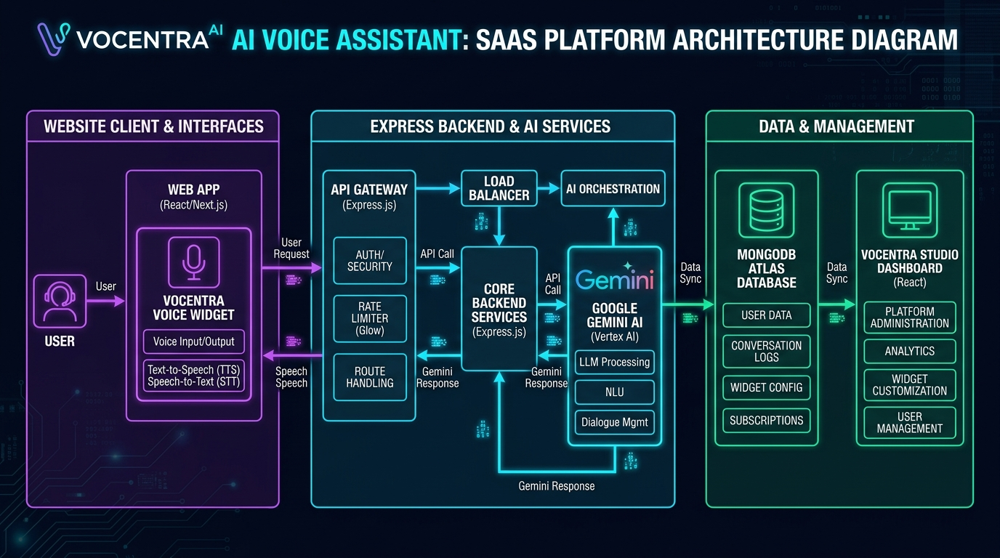

<div align="center">

# 🎙️ Vocentra
### Next-Gen AI Voice Assistant Platform & Embeddable Website Widget Engine

[](https://github.com/AbdulBasiTcs1/vocentra/actions/workflows/ci.yml)
[](https://vocentra.netlify.app)
[](https://youtu.be/st7NeaEiDwo)
[](https://vocentra-production.up.railway.app)
[](https://nodejs.org)
[](https://react.dev)
[](https://vitejs.dev)
[](https://ai.google.dev)
[](https://www.mongodb.com)
[](./LICENSE)

<br/>

**Vocentra** is a production-grade, multi-tenant conversational AI voice platform that turns any static website into an interactive, voice-driven experience in seconds. With a single `<script>` embed tag, businesses can deploy an intelligent voice agent that understands visitor intent, speaks naturally with sound-synthesized audio, and triggers hands-free client-side page navigation.

<br/>

[🌐 Live Platform](https://vocentra.netlify.app) &nbsp;·&nbsp;
[🎬 YouTube Demo](https://youtu.be/st7NeaEiDwo) &nbsp;·&nbsp;
[💻 GitHub Repository](https://github.com/AbdulBasiTcs1/vocentra) &nbsp;·&nbsp;
[🔗 Connect on LinkedIn](https://www.linkedin.com/in/abdul-basit-ab05a82b0/) &nbsp;·&nbsp;
[💬 WhatsApp Inquiries](https://wa.me/923474288135)

</div>

---

## 🎬 Live Product Demo

> Click the thumbnail below to watch the complete product walkthrough and live demonstration on YouTube:

<div align="center">

[](https://youtu.be/st7NeaEiDwo)

</div>

---

## ⚡ Why Vocentra?

Most traditional website chatbots are text-heavy, static, and largely ignored by visitors. **Vocentra** reimagines web conversational interfaces by providing:

- 🎙️ **Real-Time Voice Streaming**: Bi-directional conversational speech using browser Web Speech APIs and natural speech synthesis.
- 🧠 **Grounded Business Intelligence**: Powered by Google Gemini with custom personas, domain knowledge, and tone steering.
- 🧭 **Deterministic Auto-Navigation**: Visitors can say *"Take me to pricing"* or *"Show me the builder"* and the assistant automatically routes the browser to the exact page.
- 🔌 **Universal 1-Line Embed**: Zero dependencies. Works instantly on Shopify, WordPress, Webflow, Wix, React, Next.js, or vanilla HTML.
- 🎨 **Multi-Theme Visual Engine**: 4 out-of-the-box glassmorphic themes with interactive floating orbs and real-time audio waveforms.
- 🛡️ **Enterprise Security**: Dual-layer authentication (Bearer Tokens + SameSite Cookies), server-side Google token verification, and distributed IP rate limiting.

---

## 🏗️ System & Engine Architecture

<div align="center">



</div>

<details>
<summary>📋 View Mermaid Architecture Source</summary>

```mermaid
graph TD
    subgraph Target_Website_Embed_Environment ["🌐 Any Target Website (WordPress / Shopify / React)"]
        Visitor([Website Visitor Voice / Speech]) -->|Web Speech API STT| Widget[Vocentra Floating Voice Widget / assistant.js]
        Widget -->|POST /api/user/chat Payload| Gateway[Express REST API Gateway]
    end

    subgraph Vocentra_Cloud_Backend ["⚡ Vocentra Cloud Engine (Node.js / Express / Railway)"]
        Gateway -->|Rate Limit Shield: 40 req/min| RateLimiter[Express Rate Limiter Middleware]
        RateLimiter -->|Validate ObjectId & Sanitize Input| AuthEngine[Auth & Input Validation Controller]
        AuthEngine -->|Load Tenant Persona & Routing Context| Mongo[(MongoDB Atlas Database)]
        AuthEngine -->|Assemble Dynamic System Prompt| GeminiEngine[Google Gemini Flash API]
        Mongo -->|User Config & BYOK Key| GeminiEngine
        GeminiEngine -->|Enforced Structured Intent: replyText + [NAVIGATE: /path]| Gateway
    end

    subgraph Client_Execution_Feedback ["🔊 Instant Feedback Loop"]
        Gateway -->|JSON: replyText, navigateTo| Widget
        Widget -->|Audio Speech Synthesis TTS| AudioOut([Natural Voice Output])
        Widget -->|Execute window.location.href| RouteTransition([Dynamic Client-Side Page Navigation])
    end

    subgraph Vocentra_Studio_Management ["🛠️ Vocentra Studio Dashboard (vocentra.netlify.app)"]
        AdminUser([Business Owner / Developer]) -->|OAuth2 Sign-In| GoogleAuth[Google Firebase Auth]
        AdminUser -->|Configure Name, Tone, Pages, BYOK Key| StudioUI[React 19 / Vite Builder Studio]
        StudioUI -->|PUT /api/user/save-assistant| Gateway
    end
```

</details>

---

## ✨ Visual Themes & Customization Matrix

Vocentra features a built-in multi-theme styling engine that adapts seamlessly to any brand identity:

| Theme | Aesthetic & Color Palette | Best Suited For |
| :--- | :--- | :--- |
| **Dark Cyber** | Deep midnight gradient, neon purple-pink orb, ambient cyan waveforms | SaaS platforms, AI startups, developer tools |
| **Neon Emerald** | High-vibrancy emerald-green orb with pulsing glow, black contrast | Fintech, Web3, clean-tech, cyber products |
| **Glassmorphism** | Translucent frosted glass, subtle borders, rose-violet lighting | Luxury brands, creative agencies, design studios |
| **Light Minimal** | Clean sky-blue orb, crisp typography, subtle elevation shadows | Healthcare, E-Commerce, corporate portals |

---

## 🔌 1-Minute Universal Embed Guide

Deploying a custom voice assistant to any website requires just **one line of HTML**:

```html
<script 
  src="https://vocentra-production.up.railway.app/assistant.js" 
  data-user-id="YOUR_VOCENTRA_USER_ID">
</script>
```

### 📋 Script Attribute Reference:

| Attribute | Required | Default | Description |
| :--- | :---: | :---: | :--- |
| `data-user-id` | **Yes** | — | Your unique Vocentra tenant ID generated in the Studio. |
| `data-api-url` | *Optional* | `https://vocentra-production.up.railway.app` | Custom backend API base URL (for self-hosted servers). |

### 🚀 Platform Integration Examples:

<details>
<summary><b>⚛️ React / Next.js (App or Pages Router)</b></summary>

```jsx
import { useEffect } from "react";

export default function VoiceAssistant() {
  useEffect(() => {
    const script = document.createElement("script");
    script.src = "https://vocentra-production.up.railway.app/assistant.js";
    script.setAttribute("data-user-id", "YOUR_VOCENTRA_USER_ID");
    script.async = true;
    document.body.appendChild(script);
  }, []);

  return null;
}
```
</details>

<details>
<summary><b>🛍️ Shopify</b></summary>

1. Go to **Online Store** ➔ **Themes** ➔ **Edit Code**.
2. Open `layout/theme.liquid`.
3. Paste the `<script>` tag immediately before `</body>` and click **Save**.
</details>

<details>
<summary><b>🌐 WordPress / WooCommerce</b></summary>

1. Open your WordPress Admin Dashboard.
2. Navigate to **Appearance** ➔ **Theme File Editor** ➔ `footer.php`.
3. Paste the `<script>` snippet before `<?php wp_footer(); ?> </body>`.
*(Alternatively, paste via any "Insert Headers and Footers" plugin).*
</details>

<details>
<summary><b>🎨 Webflow / Framer / Wix</b></summary>

1. Open your Site Settings ➔ **Custom Code**.
2. Paste the `<script>` tag into the **Footer Code** / **Body End** box.
3. Publish your website.
</details>

---

## 🛡️ Security & Enterprise Architecture

- **Dual-Layer Authentication (Bearer + Cookie)**: Handles cross-origin deployments seamlessly. When browsers block third-party cookies across different domains (e.g. Netlify talking to Railway), the frontend uses `Authorization: Bearer <token>` automatically via Axios interceptors.
- **Reverse Proxy Trust**: Configured with `app.set("trust proxy", 1)` for reliable SSL termination behind Railway, Render, or Vercel edge proxies.
- **Distributed Rate Limiting**:
  - **Public Voice Chat**: 40 requests/minute per IP (`chatRateLimiter`).
  - **Authentication Endpoints**: 15 requests/15 minutes per IP (`authRateLimiter`).
- **Input Sanitization & Length Caps**: Visitor chat queries are capped and sanitized to prevent prompt injection and denial-of-service payloads.
- **Cryptographic Token Verification**: Decodes and verifies Google OAuth2 tokens using `jsonwebtoken` before creating or updating user sessions.

---

## 📡 API Reference Matrix

### 🔐 Authentication (`/api/auth`)
| Method | Endpoint | Description | Auth Required |
| :--- | :--- | :--- | :---: |
| `POST` | `/api/auth/google` | Google Firebase sign-in / registration with JWT issue | ❌ No |
| `GET` | `/api/auth/logout` | Clears auth session and cookies | ❌ No |

### 🛠️ User & Studio (`/api/user`)
| Method | Endpoint | Description | Auth Required |
| :--- | :--- | :--- | :---: |
| `GET` | `/api/user/current-user` | Fetch currently logged-in user profile & quota stats | ✅ Yes |
| `PUT` | `/api/user/save-assistant` | Update assistant config, knowledge base, tone, and routes | ✅ Yes |
| `GET` | `/api/user/assistant/:id` | Fetch tenant assistant configuration | ❌ No |
| `POST` | `/api/user/chat` | Send visitor message and receive Gemini audio/nav response | ❌ No (Rate-Limited) |

### 🌐 Public Widget Endpoints (`/api/assistant`)
| Method | Endpoint | Description | Auth Required |
| :--- | :--- | :--- | :---: |
| `GET` | `/api/assistant/:id` | Public assistant config fetch for embedded widgets | ❌ No |
| `POST` | `/api/assistant/:id/chat` | Public chat handler with keyword fallback & intent parsing | ❌ No (Rate-Limited) |

---

## 💻 Local Development Quickstart

### 1. Prerequisites
- **Node.js**: `v20.x` or higher
- **MongoDB**: Local instance (`mongodb://localhost:27017`) or [MongoDB Atlas](https://www.mongodb.com/cloud/atlas)
- **Google Gemini API Key**: [Google AI Studio](https://aistudio.google.com/)

### 2. Clone the Repository
```bash
git clone https://github.com/AbdulBasiTcs1/vocentra.git
cd vocentra
```

### 3. Setup the Backend Server
```bash
cd server
npm install

# Create your .env configuration
cp .env.example .env
```

Edit `server/.env`:
```env
PORT=8000
NODE_ENV=development
CLIENT_URL=http://localhost:5173
MONGODB_URI=mongodb://localhost:27017/vocentra
JWT_SECRET=your_super_secret_jwt_key_here
GEMINI_API_KEY=your_gemini_api_key_here
```

Start the server:
```bash
npm run dev
```

### 4. Setup the Client Application
```bash
cd ../client
npm install

# Create your .env configuration
cp .env.example .env
```

Edit `client/.env`:
```env
VITE_SERVER_URL=http://localhost:8000
VITE_FIREBASE_API_KEY=your_firebase_api_key
VITE_FIREBASE_AUTH_DOMAIN=your_project.firebaseapp.com
VITE_FIREBASE_PROJECT_ID=your_project_id
VITE_FIREBASE_STORAGE_BUCKET=your_project.firebasestorage.app
VITE_FIREBASE_MESSAGING_SENDER_ID=your_messaging_sender_id
VITE_FIREBASE_APP_ID=your_app_id
```

Start the client:
```bash
npm run dev
```

Open [http://localhost:5173](http://localhost:5173) in your browser.

---

## 📂 Project Directory Layout

```
vocentra/
├── .github/
│   └── workflows/
│       └── ci.yml               # Automated CI build & verification workflow
├── client/                      # React 19 + Vite Frontend
│   ├── public/
│   │   ├── assistant.js         # Core embedded widget script
│   │   ├── assistant.css        # Multi-theme widget stylesheets
│   │   └── _redirects           # Netlify SPA routing rules
│   ├── src/
│   │   ├── components/          # ProtectedRoute, AssistantPreview, etc.
│   │   ├── pages/               # Home, Builder Studio, Billing Hub, Login, Navbar
│   │   ├── App.jsx              # App root with Axios Bearer interceptor
│   │   └── main.jsx             # React entry point
│   ├── .env.example             # Client environment template
│   └── package.json
├── server/                      # Express + Node.js Backend API
│   ├── configs/                 # MongoDB database & Gemini AI configs
│   ├── controllers/             # Auth, User, and Assistant controllers
│   ├── middleware/              # isAuth (Dual-Auth) & rateLimiter
│   ├── models/                  # User Mongoose Schema
│   ├── public/                  # Static assets bundle for Railway deployment
│   ├── routes/                  # Auth, User, and Assistant routes
│   ├── .env.example             # Server environment template
│   ├── index.js                 # Server entry point with CORS & Trust Proxy
│   └── package.json
├── LICENSE                      # MIT Open Source License
└── README.md                    # Project documentation
```

---

## 🗺️ Roadmap & Services Hub

- [x] **v1.0 (Live MVP)**:
  - Multi-tenant Builder Studio with Google OAuth2.
  - Multi-theme widget engine (Dark, Neon, Glassmorphism, Light).
  - Intent-based page auto-navigation (`[NAVIGATE: /path]`).
  - Dual-layer Bearer/Cookie authentication with reverse-proxy trust.
  - High-ticket Done-For-You (DFY) Custom Voice Agent dev services.
- [ ] **v2.0 (In Progress)**:
  - Automated Stripe Subscription checkout & recurring billing webhooks.
  - Multi-LLM support (OpenAI GPT-4o Audio + Anthropic Claude Voice).
  - Multi-lingual STT/TTS auto-language detection.
  - Granular conversation analytics & visitor engagement telemetry.

---

## 🤝 Contributing

Contributions, issues, and feature requests are welcome!  
Feel free to check the [issues page](https://github.com/AbdulBasiTcs1/vocentra/issues).

1. Fork the Project
2. Create your Feature Branch (`git checkout -b feature/AmazingFeature`)
3. Commit your Changes (`git commit -m 'feat: Add some AmazingFeature'`)
4. Push to the Branch (`git push origin feature/AmazingFeature`)
5. Open a Pull Request

---

## 📄 License

Distributed under the **MIT License**. See [`LICENSE`](./LICENSE) for more information.

---

## 👨‍💻 Author & Contact

**Abdul Basit**  
Full-Stack AI Engineer & SaaS Builder

- 🌐 **Portfolio / Website**: [vocentra.netlify.app](https://vocentra.netlify.app)
- 💼 **LinkedIn**: [linkedin.com/in/abdul-basit-ab05a82b0](https://www.linkedin.com/in/abdul-basit-ab05a82b0/)
- 💻 **GitHub**: [@AbdulBasiTcs1](https://github.com/AbdulBasiTcs1)
- 📧 **Email**: [abdulbasit.prodev@gmail.com](mailto:abdulbasit.prodev@gmail.com)
- 💬 **WhatsApp**: [+92 347 4288135](https://wa.me/923474288135)
